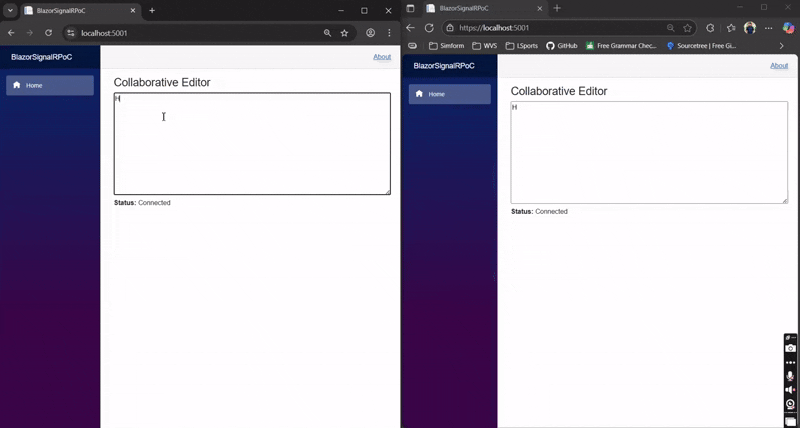

# Real-Time Collaborative Web Application using Blazor and SignalR

## 📌 What is This PoC?
This Proof of Concept (PoC) demonstrates a **real-time collaborative text editing application** using Blazor Server and SignalR. The goal is to show how .NET developers can implement collaborative, live-updating functionality in a modern web application using the power of SignalR and Blazor.

---

## 🛠 Prerequisites

- [.NET 6 SDK](https://dotnet.microsoft.com/en-us/download)
- Visual Studio 2022+ or VS Code with C# extension
- Web browser (Chrome, Edge, etc.)
- Git (to clone the repo, if applicable)

---

## 💡 When and Why to Use Blazor + SignalR

### ✅ Use Blazor Server:
- When you want a **rich UI** with full .NET on the server.
- Great for **internal tools** or **intranet apps** where latency is low.
- Ideal for rapid prototyping and real-time dashboards.

### ✅ Use SignalR:
- Needed for **real-time communication**.
- Ideal when you require **live collaboration**, **notifications**, or **chat** functionality.

---

## 🚀 How to Run the PoC

1. **Clone the Repo**
    ```bash
    git clone https://github.com/SauravBelani/BlazorSignalRPoC.git
    cd BlazorSignalRPoC
    ```

2. **Run the App**
    ```bash
    dotnet run
    ```

3. **Open Browser**
    Navigate to `https://localhost:5001`.

4. **Open in Multiple Tabs/Devices**
    Test real-time collaboration by editing in multiple tabs or devices.

---

## ⚙️ Required Configuration

### `Program.cs`
Ensure your services and middleware are configured as shown:
```csharp
var builder = WebApplication.CreateBuilder(args);

builder.Services.AddSignalR();
builder.Services.AddRazorPages();
builder.Services.AddServerSideBlazor();

var app = builder.Build();

app.UseStaticFiles();
app.UseRouting();

app.MapBlazorHub();
app.MapHub<CollaborationHub>("/collaborationHub");
app.MapFallbackToPage("/_Host");

app.Run();
```

---

## 👁️ Preview

Here's a quick demonstration:



---

## 📈 Real-World Use Cases

This PoC can be extended into full-scale applications across various industries. Here are practical examples:

### 🧑‍💼 Enterprise Collaboration Tools
- Real-time co-editing of documents, reports, or meeting notes.
- Shared dashboards for task and project tracking.

### 📚 Education Platforms
- Interactive lecture notes, collaborative whiteboards, and live coding environments.
- Group projects where students edit and comment on shared assignments.

### 💬 Customer Support Dashboards
- Support agents collaborating live on customer issues.
- Shared knowledge base editing and live ticket annotation.

### 🛠 DevOps and Monitoring Dashboards
- Live collaboration on system logs, real-time incident responses, or deployments.
- Engineers can annotate and debug system behavior together.

### 📝 Legal or Policy Review Platforms
- Simultaneous review and editing of legal documents, contracts, or policies.
- Internal legal teams or stakeholders can comment and revise live.

### 🧪 Scientific and Research Collaboration
- Joint editing of experiment logs, research papers, or lab documentation.
- Real-time collaboration for distributed research teams or labs.
